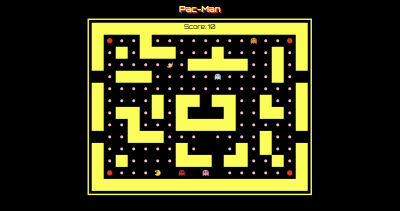
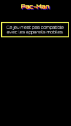

# Pac-Man

Pac-Man est un jeu d'arcade sorti en 1980. Dans ce jeu, le joueur doit éviter les fantômes tout en collectant toutes les pastilles pour progresser à travers les niveaux.

Ce jeu est codé en JavaScript et est déployé sur Netlify: **[🔗 jouer à Pac-Man en ligne](https://new-pacman-game.netlify.app/)**
 
⚠️ **Ce jeu est optimisé pour ordinateur** et nécessite l'utilisation des flèches du clavier. Il n'est pas compatible avec les appareils mobiles ou tablettes.

---

## Aperçu 

<div style="display: flex; gap: 3rem;">
  
  
</div>

---- 

## 1. But du jeu 

Le but du jeu est de manger toutes les pastilles dans le labyrinthe tout en évitant les fantômes. 


## 2. Éléments du jeu

### 2.1 Pac-Man: 

Le joueur contrôle Pac-Man qui peut se déplacer dans 4 directions (haut, bas, gauche, droite) pour manger des pastilles dans le labyrinthe.

### 2.2. Les fantômes: 

Quatre fantômes colorés poursuivent Pac-Man. Si un fantôme touche Pac-Man, ce dernier perd. 

1. Blinky (rouge): il suit directement Pac-Man cherchant à le rattraper à tout prix. Ce fantôme est le plus agressif du jeu.

2. Clyde (orange): il avance de manière aléatoire, changeant de direction chaque fois qu'il rencontre un obstacle ou lorsqu'il décide de changer de trajectoire. 

3. Pinky (rose): Pinky agit presque comme Blinky. Il se superpose à Blinky parfois. 

4. Inky (bleu clair): il alterne entre le comportement de Blinky et celui de Clyde, ce qui le rend particulièrement difficile à prévoir. 


### 2.3. Les pastilles/points:

De petites pastilles/points sont réparties dans le labyrinthe. Pac-Man doit toutes les manger pour gagner.

Chaque pastille mangée rapporte 10 points.


### 2.4. Les super-pastilles/énergies:

Il y en a 4 dans chaque niveau. Elles sont situées dans les coins du labyrinthe. 

Lorsque Pac-Man en mange une, les fantômes deviennent bleus pendant un temps limité ce qui permet à Pac-Man de les manger. 

Elles rapportent 50 points.

Manger un fantôme donne des points bonus, mais après un certain temps, les fantômes reviennent à la normale et recommencent à poursuivre Pac-Man.


### 2.5. Les fruits: 

Des fruits apparaissent dans le labyrinthe. Lorsque Pac-Man les mange, il gagne des points supplémentaires.

Les fruits bonus apparaissent à intervalles réguliers et donnent entre 100 et 250 points selon le fruit.


### 2.6. Les tunnels/vides:

Il y a des tunnels de téléportation aux extrémités du labyrinthe. Si Pac-Man entre dans un tunnel, il ressort de l'autre côté du labyrinthe.

---

## 3. Installation 

```
  git clone https://github.com/Melissa-code/pacMan.git
  cd pacMan
  Ouvrir le fichier `index.html` dans le navigateur pour commencer à jouer
```

---

## 4. Technologies : 

- **HTML** : Structure du jeu
- **CSS** : Design et mise en page
- **JavaScript** : Logique du jeu 
- **Canvas API** : Rendu du jeu

--- 

## 5. Architecture et patterns : 

### 5.1. Architecture 

Structure du projet:

📂 pacMan
┣ 📜 index.html → Structure du jeu
┣ 📜 style.css → Styles et mise en page
┣ 📂 models → Contient les classes du jeu
│ ┣ 📜 Fantome.js → Représente un fantôme
│ ┣ 📜 PacMan.js → Représente Pac-Man
│ ┣ 📜 Fruit.js → Représente un fruit
│ ┣ 📜 FabriqueFruit.js → Gère la création des fruits
│ ┣ 📜 PlateauJeu.js → Gère le plateau de jeu
│ ┗ 📜 Directions.js → Enum des directions
│ ┗ 📜 ElementType.js → Enum des éléments (mur, vide, point, energie, fruit)
┣ 📜 Vue.js → Gère l'affichage du jeu et les interactions utilisateur
┗ 📜 controller.js → Point d’entrée, initialise le jeu et la logique principale
┗ 📜 images → Contient les images du jeu


### 5.2. Patterns utilisés

- **MVC (Model-View-Controller)**  
  - `models/` contient la logique du jeu (Modèle).  
  - `Vue.js` s’occupe de l'affichage (Vue).  
  - `controller.js` fait le lien entre les modèles et la vue (Contrôleur)

- **Factory Pattern**  
  - `FabriqueFruit.js` est une **fabrique** qui crée les différents fruits du jeu.  

---


## 6. Author 

- Melissa-code